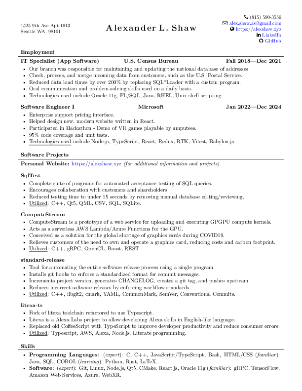

# Resume

Alex Shaw's Résumé.

The latest can always be found at <https://github.com/Symbitic/resume/releases/download/latest/resume.pdf>.

## Note

This résumé uses a modified version of the [LuaLaTeX class](https://github.com/dnl-blkv/mcdowell-cv) designed by Gayle L. McDowell. 
The original is available here: https://www.careercup.com/resume

I first found the résumé template from here: https://www.freecodecamp.org/news/writing-a-killer-software-engineering-resume-b11c91ef699d/
